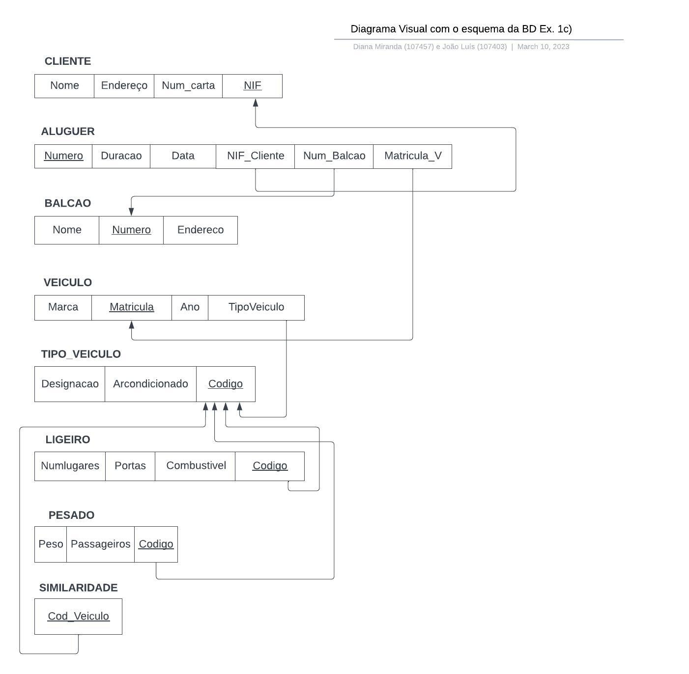
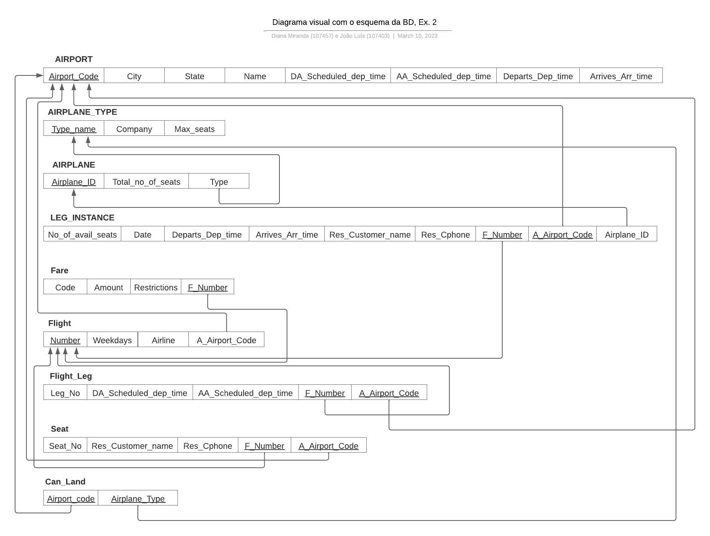
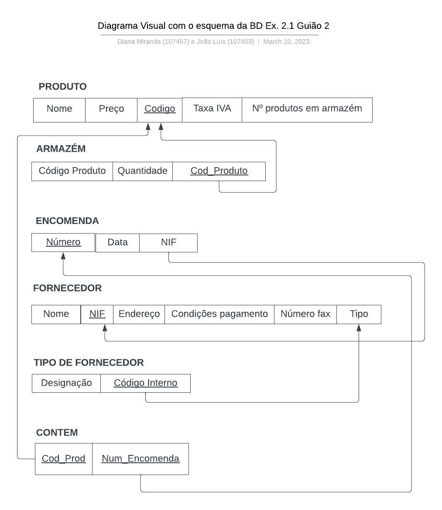
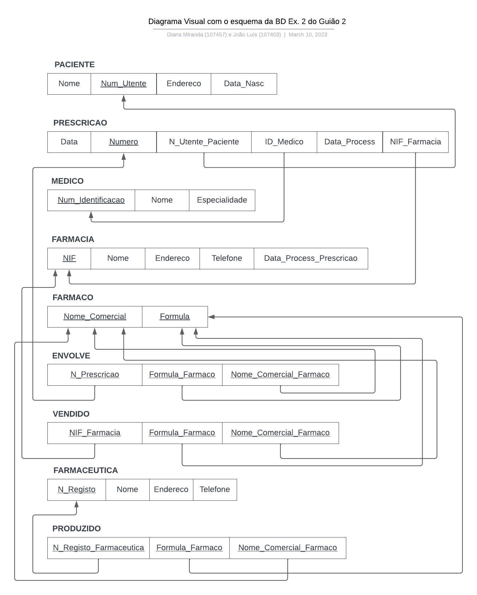
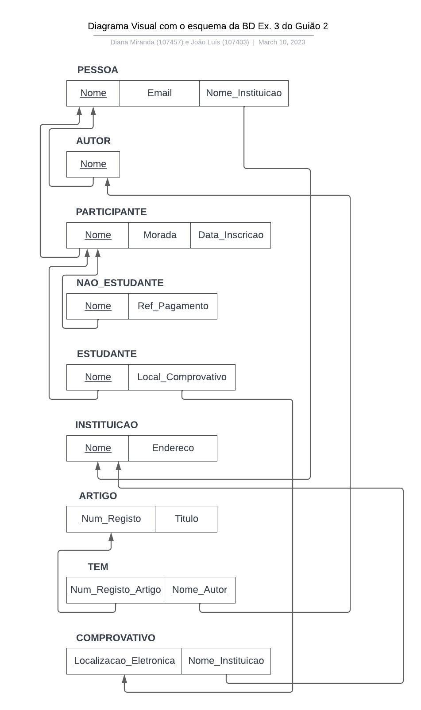
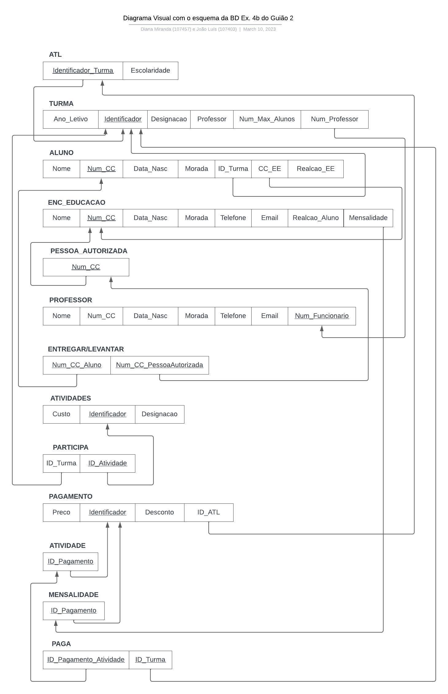

# BD: Guião 3

## ​Problema 3.1
 
### *a)*

Relação Cliente
Relação Aluguer
Relação Balcao
Relação Veiculo
Relação Tipo_Veiculo
Relação Ligeiro
Relação Pesado
Relação Similaridade

Esquema de Relação:
    Cliente(Nome, Endereco, Num_Carta, NIF)
    Aluguer(Numero, Duracao, Data, NIF_Cliente, Num_Balcao, Matricula_V)
    Balcao(Nome, Endereco, Numero)
    Veiculo(Matricula, Ano, Marca, TipoVeiculo)
    Tipo_Veiculo(Designacao, ArCondicionado, Codigo)
    Ligeiro(NumLugares, Portas, Combustivel, Codigo)
    Pesado(Peso, Passageiros, Codigo)
    Similiaridade(Cod_Veiculo)

### *b)* 

Relação Cliente
    - Chaves Candidatas: Num_Carta, NIF
    - Chave Primária: NIF

Relação Aluguer
    - Chaves Candidatas: Numero
    - Chave Primária: Numero
    - Chave Estrangeira: NIF_Cliente, Num_Balcao, Matricula_V

Relação Balcao
    - Chaves Candidatas: Numero
    - Chave Primária: Numero

Relação Veiculo
    - Chaves Candidatas: Matricula
    - Chave Primária: Matricula
    - Chave Estrangeira: TipoVeiculo

Relação Tipo_Veiculo
    - Chaves Candidatas: Codigo, Designacao
    - Chave Primária: Codigo

Relação Ligeiro
    - Chaves Candidatas: Codigo
    - Chave Primária: Codigo
    - Chave Estrangeira: Codigo

Relação Pesado
    - Chaves Candidatas: Codigo
    - Chave Primária: Codigo
    - Chave Estrangeira: Codigo

Relação Similiaridade
    - Chaves Candidatas: Cod_Veiculo
    - Chave Primária: Cod_Veiculo
    - Chave Estrangeira: Cod_Veiculo

### *c)* 

## ​Problema 3.2

### *a)*

Relação Airport
Relação Airplane_Type
Relação Airplane
Relação Leg_Instance
Relação Fare
Relação Flight
Relação Flight_Leg
Relação Seat
Relação Can_Land

Esquemas de relação:

    Airport(Airport_code, City, State, Name, DA_Scheduled_dep_time, AA_Scheduled_dep_time, Departs_Dep_time, Arrives_Arr_time)

    Airplane_Type(Type_name, Company, Max_seats)

    Airplane(Aiplane_id, Total_no_of_seats, Type)

    Leg_Instance(No_of_avail_seats, Date ,Departs_Dep_time, Arrives_Arr_time, Res_Customer_name, Res_Cphone, F_Number, A_Airport_Code, Airplane_id)

    Fare(Code, Amount, Restrictions, F_Number)

    Flight(Number, Weekdays, Airline, Airport_code)

    Flight_Leg(Leg_no, DA_Scheduled_dep_time, AA_Scheduled_dep_time, F_Number, A_Airport_Code)

    Seat(Seat_no, Res_Customer_name, Res_Cphone, F_Number, A_Airport_Code)

    Can_Land(A_Airport_Code, Airplane_Type)

### *b)* 

Relação Airport
    - Chaves Candidatas: Aiport_code
    - Chave Primária: Aiport_code
Relação Airplane_Type
    - Chaves Candidatas: Type_name
    - Chave Primária: Type_name
Relação Airplane
    - Chaves Candidatas: Airplane_id
    - Chave Primária: Airplane_id
    - Chave Estrangeira: Type
Relação Leg_Instance
    - Chaves Candidatas: F_Number, A_Airport_Code
    - Chaves Primária: F_Number e A_Airport_Code
    - Chaves Estrangeiras: F_Number, A_Airport_Code, Airplane_id
Relação Fare
    - Chaves Candidatas: Code, F_Number
    - Chaves Primária: F_Number
    - Chaves Estrangeiras: F_Number
Relação Flight
    - Chaves Candidatas: Number
    - Chaves Primária: Number
    - Chave Estrangeita: Airport_code
Relação Flight_Leg
    - Chaves Candidatas: Leg_no, F_Number, A_Airport_Code
    - Chaves Primária: F_Number e A_Airport_Code
    - Chaves Estrageiras: F_Number, A_Airport_Code
Relação Seat
    - Chaves Candidatas: Seat_no, F_Number, A_Airport_Code
    - Chaves Primária: F_Number e A_Airport_Code
    - Chaves Estrageiras: F_Number, A_Airport_Code
Relação Can_Land
    - Chaves Candidatas: A_Airport_Code, Airplane_Type
    - Chaves Primária: A_Airport_Code, Airplane_Type
    - Chaves Estrageiras: A_Airport_Code, Airplane_Type

### *c)* 

## ​Problema 3.3

### *a)* 2.1

### *b)* 2.2

### *c)* 2.3

### *d)* 2.4

